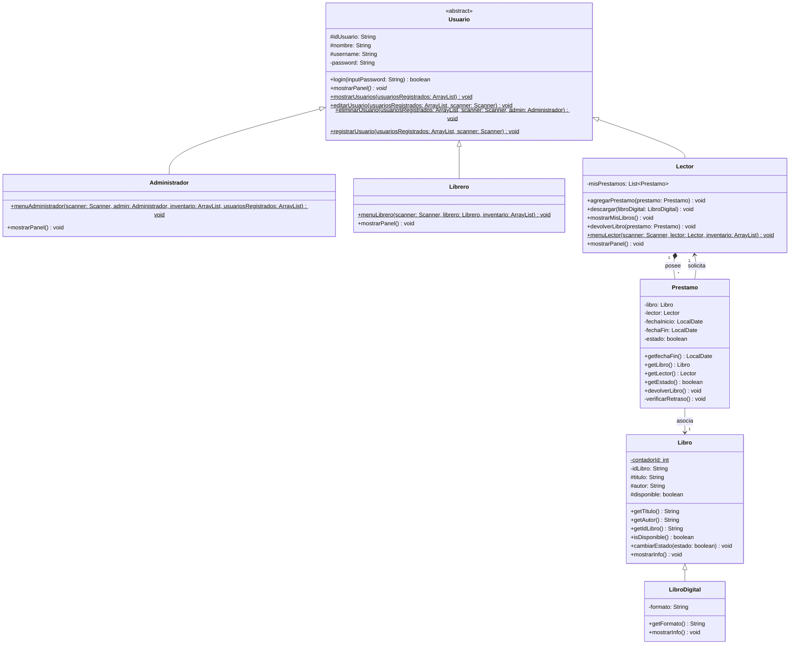
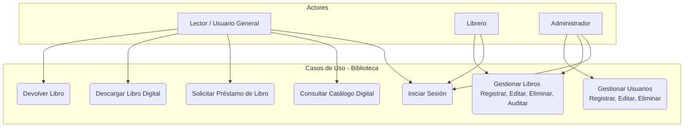
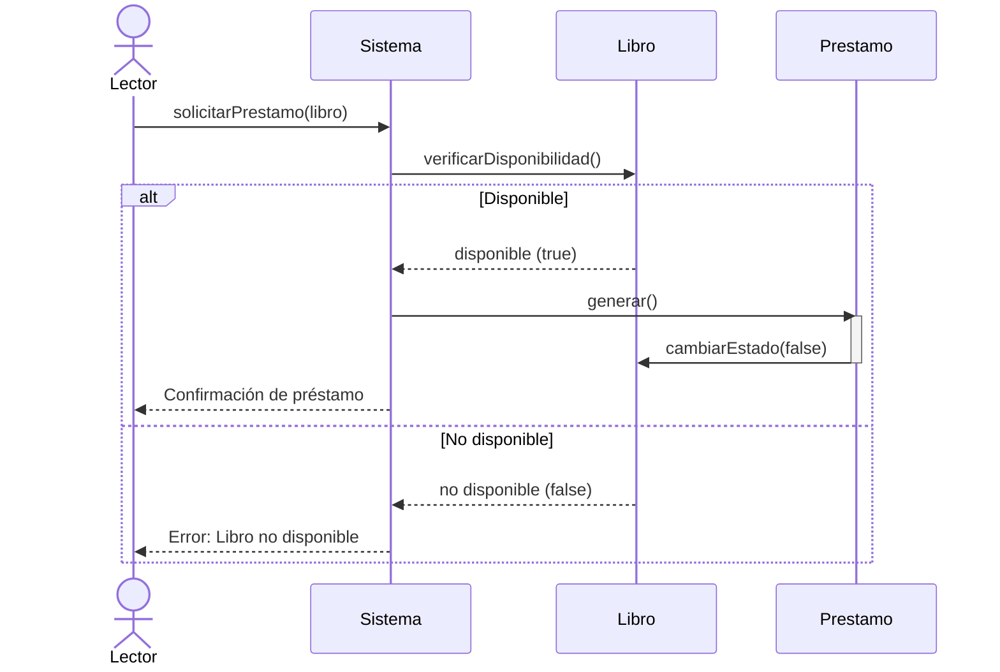

# 📚 Sistema de Gestión de Biblioteca Digital

¡Bienvenido al **Sistema de Gestión de Biblioteca Digital**! Este es un proyecto desarrollado para la materia de **Programación Orientada a Objetos (POO)** en el **2do Cuatrimestre** del grupo **02IDESMA** en **CESUN Universidad**.

El sistema es una aplicación de consola en Java diseñada para administrar el flujo completo de una biblioteca digital, incluyendo el registro de usuarios con diferentes roles, la consulta del catálogo de libros digitales, solicitudes de préstamos de libros, descargas, devoluciones y reportes de inventario.

---

## 👥 Integrantes del Equipo

* **Carlos Alberto Gomez Cisneros**
* **Gese Aaron Ontiveros Morales**
* **Carla Mayreth Valladares Muñoz**

**Profesora:** Arisbeth Bernal Salinas  
**Materia:** Programación Orientada a Objetos  
**Fecha de Entrega:** Jueves 19 de febrero, 2026  

---

## 🏗️ Arquitectura del Sistema

El sistema sigue una propuesta de **arquitectura en capas** para mantener el código organizado, modular y escalable:

1. **Capa de Presentación (Interfaz de Usuario)**: Representada por la clase `Index` y los menús interactivos de consola para cada rol de usuario.
2. **Capa de Lógica de Negocio**: Clases de dominio como `Usuario` (y sus derivados: `Administrador`, `Librero`, `Lector`), `Libro` (y `LibroDigital`) y `Prestamo` que controlan las transacciones y validaciones.
3. **Capa de Persistencia (Simulada)**: Estructuras en memoria (`ArrayList`) en el `Index` que albergan el inventario y los usuarios registrados temporalmente durante la ejecución.

---

## 🗺️ Diagramas del Sistema

### 1. Diagrama de Clases (POO)

A continuación se muestra la estructura de clases del sistema utilizando la sintaxis de Mermaid. Este diagrama ilustra las relaciones de herencia, asociación y encapsulamiento:



### 2. Diagrama de Casos de Uso

Muestra las interacciones que tienen los diferentes roles (Lector, Librero, Administrador) con el sistema:



### 3. Diagrama de Secuencia (Solicitud de Préstamo)

Describe el flujo cuando un Lector solicita el préstamo de un libro digital:



---

## 🌟 Conceptos de Programación Orientada a Objetos Aplicados

### 1. Encapsulamiento
* Los atributos de datos críticos como `password` en `Usuario` o los detalles de la transacción en `Prestamo` (`libro`, `lector`, `fechaInicio`, `fechaFin`, `estado`) se declaran como **privados** (`private`) o **protegidos** (`protected`).
* El acceso y modificación de estos atributos se realiza exclusivamente mediante métodos públicos de control (Getters y Setters), lo que protege la información sensible y evita manipulaciones directas indebidas desde fuera de la clase.

### 2. Herencia
* Evitamos la duplicidad de código compartiendo lógica a través de la relación de herencia:
  * `Administrador`, `Librero` y `Lector` heredan de la clase abstracta `Usuario`.
  * `LibroDigital` hereda de la clase base `Libro`.
* Esto nos permite estructurar de forma jerárquica las entidades compartiendo atributos comunes como nombres, credenciales y títulos.

### 3. Polimorfismo
* **Polimorfismo de métodos**: El método abstracto `mostrarPanel()` definido en `Usuario` se comporta de manera distinta dependiendo del rol específico del objeto instanciado (`Administrador`, `Librero`, o `Lector`).
* **Sobrescritura (@Override)**: La clase `LibroDigital` sobrescribe el método `mostrarInfo()` de `Libro` para añadir información particular (como el formato del archivo digital).
* **Manejo Dinámico**: En la clase `Index`, el inicio de sesión maneja objetos de tipo `Usuario` genéricos, permitiendo mediante polimorfismo y `instanceof` redirigir dinámicamente a los paneles específicos de cada rol.

---

## 📂 Estructura del Proyecto

A continuación se detalla la organización de carpetas y archivos en el workspace:

```text
biblioteca/
├── lib/
│   └── junit-platform-console-standalone-1.13.0-M3.jar   # Librería para pruebas unitarias
├── src/
│   ├── app/
│   │   ├── Index.java                                    # Clase principal / Punto de entrada
│   │   └── Index.class
│   ├── classes/
│   │   ├── libros/
│   │   │   ├── Libro.java                                # Clase padre Libro
│   │   │   ├── LibroDigital.java                         # Clase hija LibroDigital
│   │   │   └── Libro.class
│   │   ├── operaciones/
│   │   │   ├── AuditarInventario.java                    # Reporte de estado e inventario
│   │   │   ├── EditarLibro.java                          # Lógica de edición de libros
│   │   │   ├── EliminarLibro.java                        # Lógica de borrado de libros
│   │   │   ├── MostrarInventario.java                    # Visualización del inventario
│   │   │   ├── PedirLibro.java                           # Gestión de préstamos de libros
│   │   │   ├── Prestamo.java                             # Clase que representa una transacción de préstamo
│   │   │   ├── RegistrarLibro.java                       # Registro de nuevos libros
│   │   │   └── Prestamo.class
│   │   └── usuarios/
│   │       ├── Usuario.java                              # Clase base abstracta Usuario
│   │       ├── Administrador.java                        # Rol Administrador
│   │       ├── Librero.java                              # Rol Librero
│   │       ├── Lector.java                               # Rol Lector
│   │       ├── Usuario.class
│   │       ├── Administrador.class
│   │       └── Lector.class
│   ├── tools/
│   │   └── limpiar.java                                  # Utilidad para limpiar la consola (OS-friendly)
│   └── utils/
│       └── estructuraCarpetas.png                        # Representación gráfica del directorio
├── descripcion,uml,casodeuso.pdf                         # Documento de diseño original (PDF)
└── README.md                                             # Guía de documentación del proyecto
```

---

## 🚀 Compilación y Ejecución

Para compilar y ejecutar el proyecto desde la terminal, asegúrate de tener instalado el **Java Development Kit (JDK 8 o superior)** y posicionarte en la raíz del proyecto.

### Paso 1: Compilar todos los archivos fuente
Ejecuta el siguiente comando para compilar todas las clases del proyecto:

```bash
javac src/app/Index.java src/classes/libros/*.java src/classes/operaciones/*.java src/classes/usuarios/*.java src/tools/*.java
```

### Paso 2: Ejecutar el sistema
Una vez compilado, puedes correr la aplicación usando:

```bash
java src.app.Index
```

---

## 🔑 Credenciales de Prueba por Defecto

El sistema se inicializa con los siguientes usuarios cargados para facilitar su prueba:

| Nombre | Usuario (Username) | Contraseña (Password) | Rol del Usuario |
| :--- | :--- | :--- | :--- |
| **Carlos** | `admin` | `admin` | Administrador |
| **Luis** | `lib` | `lib` | Librero |
| **Carla** | `dev` | `dev` | Lector |
| **Aaron** | `lector` | `lector` | Lector |

*Escribe `salir` en el prompt del usuario en la pantalla de inicio de sesión para apagar el sistema.*

---

## 🔍 Notas del Desarrollador y Quirks Identificados

Durante la auditoría del código, se han identificado las siguientes particularidades:
* **Índice 0 en Inventario**: En las búsquedas, ediciones y listados del inventario (como en `PedirLibro.java` o `EditarLibro.java`), los bucles comienzan en el índice `1` (`i = 1`), lo que provoca que el primer libro del catálogo (índice `0`, originalmente `"Manual de sistema"`) no se visualice en la interfaz interactiva.
* **Menú del Librero (Cerrar Sesión vs Editar)**: En `Librero.java`, la opción número `3` se visualiza en consola como "Cerrar sesión", pero ejecuta la lógica de "Editar Libro" y mantiene el bucle activo hasta ingresar una opción `4`.
* **Cálculo en Reporte de Estado**: En `AuditarInventario.java`, la variable `disponibles` se inicializa con el total del tamaño de la lista (`total`) y luego se le vuelve a sumar por cada libro que se encuentra en estado disponible, inflando el número de libros disponibles mostrados en el reporte.
